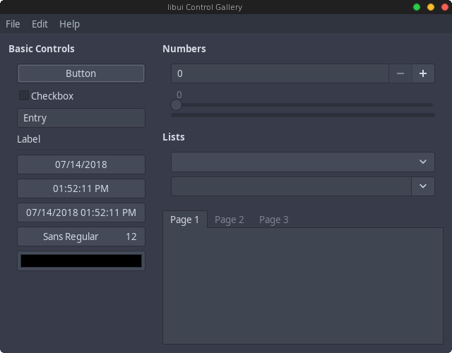

# Libui

##Perl6 binding to [libui](https://github.com/andlabs/libui)

###Cross-platform: Windows, Mac, Linux

This library provides an object-oriented interface to libui.

###Basic Use:

> Init();

> my Libui::App $app .= new("test");

> $app.root.closing.tap({$app.exit});

> $app.run();

Install with :
> zef install Libui;

##Examples:
###Controlgallery Tab: Basic Controls

Linux:

Windows:

Macos:

